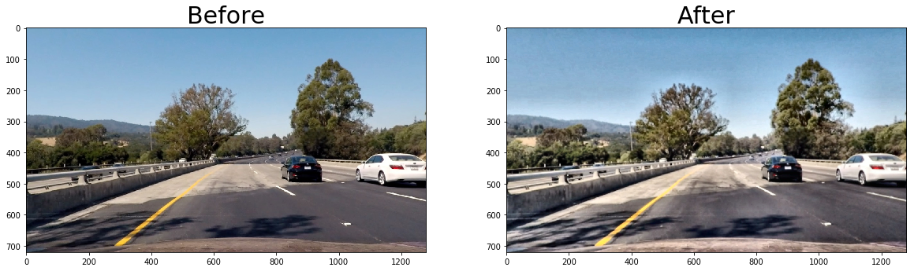
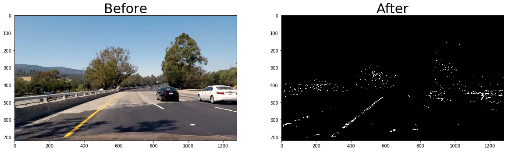
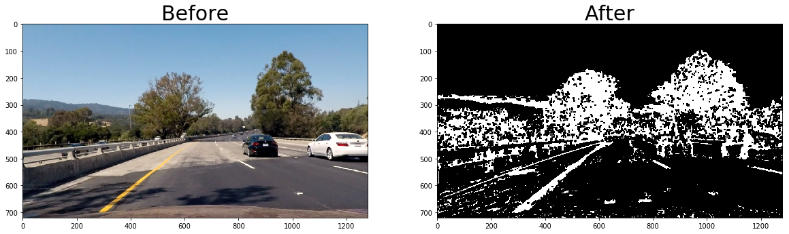

## Advanced Lane Finding
The goal of this project is to identify road lane lines on a video.

For results of pipeline code execution, please check out [`Pipeline.ipynb`](Pipeline.ipynb) notebook.
The pipeline consist of the following steps:

### Camera calibration 

You can find all code for camera calibration and distortion correction in [`camera.py`](camera.py) file.

The first and crucial step is to calibrate the camera to correct images distortion. To achieve that we need to extract object points from images. Images from `camera_cal` folder could help us to do that. We need to find chessboard corners on provided chessboard images using `findChessboardCorners` OpenCV function. 
Next,  we can calibrate a camera using these points as input to `calibrate_camera` function, and as a result, we now have distortion coefficients and camera matrix. 
Let's save results to [`calibration_data.p`](camera_cal/calibration_data.p) file to be able to skip calibration step in the future. 
We can now undistort out images using camera matrix and distortion coefficients and OpenCV `undistort` function. 
The result of distortion correction is shown below. 


### Image preprocessing

All code related to image preprocessing and image thresholding is located in [`processing.py`](processing.py) file. 

Before starting image thresholding, let’s perform simple brightness correction. We use gamma correction method for this. For additional info about gamma correction check out [OpenCV docs](https://docs.opencv.org/3.4/d3/dc1/tutorial_basic_linear_transform.html).  
 We use `gamma=0.7` to make dark image parts lighter. This step could help to detect road lines on the shadowed road parts, where light/shadow contrast could lead to confusion and incorrect results. Also, to reduce noisiness I’ve used [Gaussian blur](https://docs.opencv.org/3.1.0/d4/d13/tutorial_py_filtering.html) with kernel size of 3. 

The results of preprocessing: 


### Color and gradient thresholding 

The goal of the next step is to combine color thresholding with gradient thresholding to find road lines and eliminate all unnecessary info. 

I’ve tried Sobel x and y thresholding, magnitude and direction thresholding and achieved the following results: 


Combined gradient thresholding result: 


After a bunch of experiments, I concluded that the balance between efficiency and lines detection is to use [Sobel derivative](https://docs.opencv.org/2.4/doc/tutorials/imgproc/imgtrans/sobel_derivatives/sobel_derivatives.html) thresholding on `x` axis. 
As for color thresholding, I’ve chosen S-channel thresholding. In function `processing.s_channel_threshold` I convert an RGB image to HLS, separate S channel, and drop out all pixels that are not in the threshold range. 
The test result is: 


The result of combined Sobel and S-channel thresholding:


### Perspective transform 
In this essential step, I perform a perspective transform of an image to obtain a bird view image of the road. 
Here I take a straight line part of the road, chose the area of the road which I’d like to transform. I wanted to avoid hard-coding road points in pixels and selected them the following way: 

```
p1 = [img_size[0]*.15, img_size[1]]     #left bottom
p2 = [img_size[0]*.44, img_size[1]*.65] #left top
p3 = [img_size[0]*.56, img_size[1]*.65] #right top
p4 = [img_size[0]*.87, img_size[1]]     #right bottom
 
```

These are the source points of future transformation. The destination points are just a simple rectangle with width margin of 25% of the image width. 
Calculated points are saved for the future usage (we know that all our test images are of the same size, so we can save pixel value and reuse them; however for different image sizes we need to calculate source and destination points again).
I perform transform in the `processing.perspective_transform` function where the source and destination points are used to get perspective transformation matrix and cut and convert an original image to bird view image. 


### Finding lane line pixels and fitting the polynomial 

All the code related to lines detection is in [`detection.py`](detection.py) file.

Now when we have thresholded and warped binary, we can find lane lines and fit them with a polynomial. 
If we don’t have any info from the previous fit, we need to perform the sliding window algorithm. The code for this algorithm is taken from lesson quiz and encapsulated in `detection.sliding_window`  function. The underlying logic is following: we take the bottom part of an image (which is closer to the vehicle), detect left and right lines basepoint by finding the peaks in the summed pixel values along the image x-axis. 
After that, we move piece-by-piece from these basepoints from bottom to the top and save all non-zero pixels in the `window`. The only difference from the code in the quiz is that if the line was not detected in the current window(`len(good_inds) >= minpix`) we return window center to basepoint instead of placing above the current. 
Now when we have all pixels, associated with left and right lane lines, we can fit them with two polynomials. I do it in `detection.fit_poly` function, which returns second order polynomial coefficients for left and right lines. 
If we already have a polynomial from a previously detected line, we can skip the sliding window step and run `detection.search_around_poly` function, which performs lookup around polynomial lines in a given margin.


### Calculating lane curvature and vehicle position with respect to center 

To measure lane curvature, we need to calculate it in meters for each lane line and find it’s average. 
To calculate the curvature in meters, I used the formula from the lesson, the point, in which we’d like to know the curvature is the bottom of an image (the closest to the vehicle point). 

To correctly calculate the curvature in meters we should know the lane width and length in both pixels and meters. 
So we know that line width in meters is 3.2, and the line height in pixels is equal to an image height. But we need to get lane width in pixels and lane length in meters. 
We can measure lane width in pixels by looking at the bottom pixels of right and left lines at the warped image and calculating the difference between them. The trickier part is the lane length: we can look at the warped image and count lane segments, as each segment and a gap is around 3-4 meters long. 
I’ve put all these values into a dictionary to make the calibration process easier. 
For test images and basic video, these values are: 

```
"width_px": 680,
"length_px": 720,
"width_m": 3.2,
"length_m": 20.
 ```
 
For more code and less words check out `detection.measure_curvature` function. 

To measure the vehicle position with respect to the center, I’ve created `detection.calc_vehicle_shift_m` function, which logic is the following: 
- define `y_eval` which is the point at the y-axis, at which we measure the vehicle shift
- get right and lane positions at this point 
- find the center of the road lane which is the central point between right and left lines
- the distance from the left image border to the lane center would be the center point, calculated above 
- the distance from the right border to the lane center would be `img_width - center_of_lane`
- the resulting position would be the difference between the distance from the left image border to the lane center and the distance from the right border to the lane center scaled by meters (because all previous calculation were in pixels).

### Putting all together

The final implementation of the algorithm is in the [`main.py`](main.py) file. Also, you can find all the logic for video processing and optimization. 
Results of test images lane detection: 


### Processing the video
Processing the video needs more complicated logic (which is encapsulated in `main.find_lane_on_video` function). As the video is the sequence of images, we can go farther than just using the same algorithm as for the pictures to find the road lanes. We can use the lane detected on the previous frame to improve line detection on the current frame. 
So the essential points of my video processing logic are: 
1. I’ve created `Line` and `Lane` classes to share the information between frames I’ve created (`Line` is taken from the lesson and modified). 

2. To define whether the lane was detected correctly and we can use this info for the next frame, class `Lane` contains `sanity_check` function which assumes, that the road lane is detected correctly if:
 - lane width is about standard (3.2 meters)
 - left and right lines are more or less parallel 
 - the lane curvature doesn’t differ much from the previous lane curvature 
 - the left and right lines positions haven’t changed much of the prior frame 
 
3. If the algorithm fails to detect lane which passes sanity check, we use fit from the last successfully detected lane for smoothing the results and avoiding road “jumping” from frame to frame. But this won’t work for too long, so if we fail to detect lane for 25 (`wait_steps`) frames in a row, we need to start over, perform sliding window search, etc. etc.

  


For challenge video, I’ve changed some parameters for conversion pixels to meters, because the lane is more narrow at this video, and it didn’t pass the sanity check for the line width with previous values. The results are far from perfect, but much better than just frame-after-frame processing. 

Harder challenge results are just very sad :( 
  
To see all results check out [project_video.mp4](output_videos/project_video.mp4), [challenge_video.mp4](output_videos/challenge_video.mp4) and [harder_challenge_video.mp4](output_videos/harder_challenge_video.mp4)

